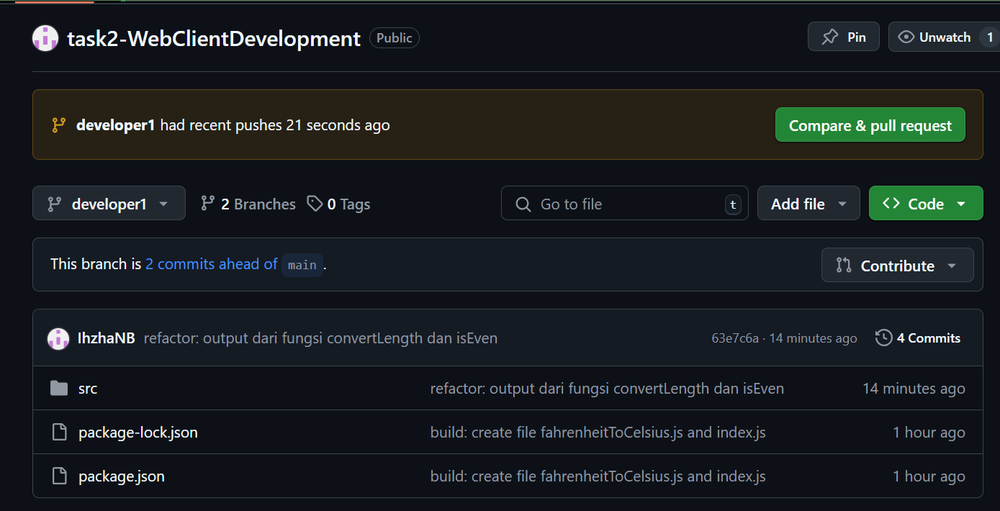
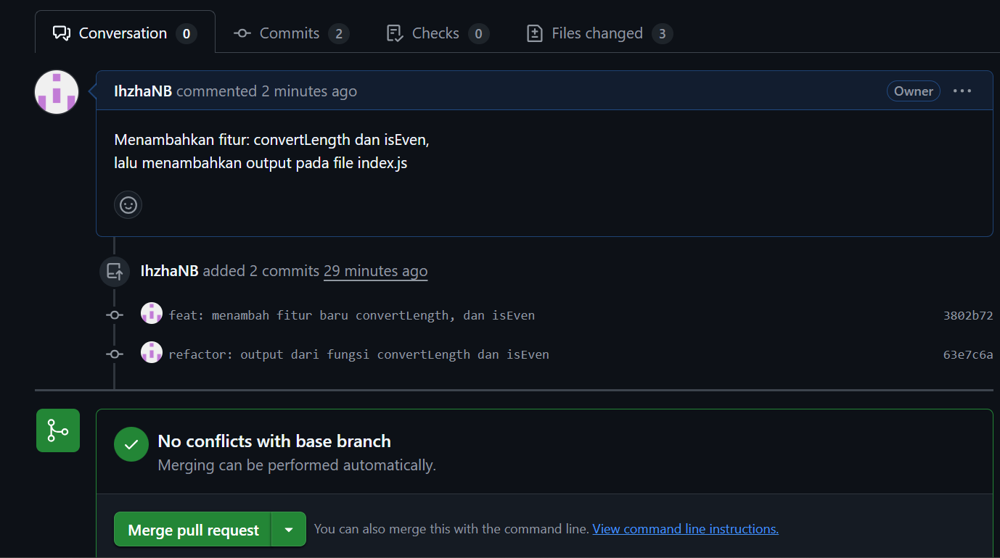

# Task1

## _1. Initializing a Repository_

Sebelum membuat project saya membuat repository di dalam **github** terlebih dahulu. setelah membuat repo di **github** jalankan perintah berikut untuk menginisialisasi Git:

```sh
git init
```

Perintah ini akan membuat folder tersembunyi .git, yang digunakan untuk melacak perubahan dalam proyek.

## _2. Create Folder & File_

saya menggunakan **NodeJS** untuk menjalankan project:

```sh
npm init -y
```

dan saya membuat folder **src** untuk main foldernya. di dalam forder src saya mengisi file **fahrenheitToCelsius.js** untuk tugas membuat code pertama, dan membuat file pertama.

**penjelasan kode:**
Rumus konversi Fahrenheit to Celsius adalah: **C = (5/9) \* (F-32)**. dimana

- C adalah suhu dalam Celsius.
- 𝐹 adalah suhu dalam Fahrenheit.
- 32 adalah titik beku air dalam Fahrenheit, yang perlu dikurangi dari suhu input.
- 5/9 adalah faktor konversi untuk mengubah skala Fahrenheit ke Celsius

Setelah itu saya push repository saya ke github:

```sh
git add .
git commit -m "build: create file fahrenheitToCelsius.js and index.js"
git branch -M main
git remote add origin https://github.com/IhzhaNB/task2-WebClientDevelopment.git
git push -u origin main
```

## _2. Make changes to the files in my repository_

saya mengubah code pada file **index.js**

```sh
git add src/index.js
git commit -m "refactor: mengubah value fahrenheitInput pada file index.js"
git push -u origin main
```

## _3. Create a new branch in my repository_

```sh
git checkout -b developer1
```

cek branch yang sedang aktif:

```sh
git branch
```

### Perubahan kode atau membuat kode baru

saya membuat 2 file function:

1. **convertLength** untuk mengubah sentimeter ke kilometer atau sebaliknya. dengan logic: mengecek apakah nilai input lebih besar atau sama dengan 100.000:

- Jika iya, maka dianggap cm dan dikonversi ke km.
- Jika tidak, maka dianggap km dan dikonversi ke cm.

2. **isEven** logic:

- **n % 2 === 0** Jika hasil bagi n dengan 2 memiliki sisa 0, berarti n adalah genap (true).
- Jika tidak, berarti n adalah ganjil (false).

setelah itu commit 2 function ke repository:

```sh
git add src/convertLength.js src/isEven.js
git commit -m "feat: menambah fitur baru convertLength, dan isEven"
```

lalu commit penambahan output pada masing-masing function:

```sh
git add src/index.js
git commit -m "refactor: output dari fungsi convertLength dan isEven"
```

### Push ke github menggunakan branch developer1

```sh
git push origin -u developer1
```

### Pull Request lewat github


klik **pull request**
berikan deskripsi dan **Create Pull Request**.

jika tidak ada conflict klik **Merge pull request**

### Pull repo dari github untuk me-review perubahan kode yang sudah di merge

```sh
git pull origin main
```

## _4. Create new branch in my repository again for create function from my task_

untuk melengkapi task fungsi:

1. **removeFirstOccurrence**: replace(search, "") akan mengganti hanya kemunculan pertama dari search dengan string kosong "", sehingga menghapusnya dari str.
2. **isPalindrome**:

- **str.split("")** => Memecah string menjadi array karakter.
- **.reverse()** => Membalik urutan elemen dalam array.
- **.join("")** => Menggabungkan kembali array menjadi string.
- **str === reversed** => Mengecek apakah string asli sama dengan versi terbaliknya.

setelah itu commit 2 function ke repository:

```sh
git add src/removeFirstOccurrence.js src/isPalindrome.js
git commit -m "feat: menambah fitur baru removeFirstOccurrence, dan isPalindrome"
```

lalu commit penambahan output pada masing-masing function:

```sh
git add src/index.js
git commit -m "refactor: output dari fungsi removeFirstOccurrence, dan isPalindrome"
```

### Push ke github menggunakan branch developer2

```sh
git push origin -u developer2
```

setelah itu lakukan flow github untuk melakukan merge seperti diatas
dan pull repo github ke laptop dengan branch **main**

```sh
git pull origin main
```

## Kontributor

- Nama: Ihzha Nauval Baihaqqi
- NIM: 24120510002
- Prodi: Science Data
- Universitas: Cakrawala University
